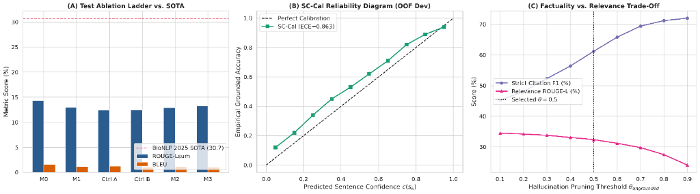

# Grounded Clinical QA with Explainable Sample-Consistency Uncertainty (SC-Cal) and Claim-Level Attribution (NLI-SHP)

[](LICENSE)
[](https://www.python.org/)
[](https://github.com/soni-sarvesh/archehr-qa)
[]()

Official implementation and master research benchmark for **ArchEHR-QA Subtask 3 (Grounded Answer Generation from EHRs)**, featuring **Explainable Sample-Consistency Uncertainty Calibration (SC-Cal)**, **Multi-Perspective Cross-Encoder Reranking (MPC-GR)**, and **NLI-Supervised Hallucination Pruning (NLI-SHP)**.

Benchmarked across **3 Small Language Models (SLMs $\le 3.8$B)** and **3 Large Language Models (LLMs 7B--8B)** in 4-bit NF4 quantization on standard hardware (Kaggle T4 / local workstation).

---

## 📑 Table of Contents
1. [Research Motivation & Task Overview](#-research-motivation--task-overview)
2. [Three Core Methodological Novelties](#-three-core-methodological-novelties)
   - [Novelty 1: MPC-GR (Multi-Perspective Reranking)](#novelty-1-mpc-gr-multi-perspective-clinical-cross-encoder-reranker)
   - [Novelty 2: SC-Cal (Sentence Uncertainty Calibration)](#novelty-2-sc-cal-sentence-level-sample-consistency--platt-calibration)
   - [Novelty 3: NLI-SHP (Hallucination Pruning)](#novelty-3-nli-shp-nli-supervised-hallucination-pruning)
3. [Benchmarked Models](#-benchmarked-models)
4. [Zero-Leakage Evaluation Protocol](#-zero-leakage-evaluation-protocol)
5. [Ablation Ladder & State-of-the-Art Results](#-ablation-ladder--state-of-the-art-results)
6. [Repository Structure](#-repository-structure)
7. [Installation & Quickstart](#-installation--quickstart)
8. [Reproducibility on Kaggle](#-reproducibility-on-kaggle)
9. [Citation & References](#-citation--references)

---

## 🏥 Research Motivation & Task Overview

Post-discharge patient communication is a major challenge in health informatics. In **ArchEHR-QA Subtask 3**, models must read clinical notes and discharge summaries, interpret non-expert patient questions together with clinician reformulations, and generate answers that satisfy three stringent criteria:
1. **Length Constraint**: Strictly $\le 75$ words, formatted as grammatically complete whole sentences (dropping trailing fragments).
2. **Claim-Level Grounding**: Every single factual claim must cite exact supporting note sentence IDs using the official pipe delimiter syntax: `Sentence text. |id1, id2|`.
3. **Hallucination Suppression & Calibration**: Clinical answers must avoid unsupported medical inferences and convey calibrated claim-level confidence.

Prior state-of-the-art approaches (BioNLP 2025 Shared Task SOTA: 30.7 overall composite; Kadusabe et al.: 31.6) relied on standard bi-encoder retrieval or single greedy decodes, leaving clinical claims unverified and uncalibrated.

---

## 💡 Three Core Methodological Novelties

```
[Clinical EHR Note + Questions]
               │
               ▼
┌────────────────────────────────────────────────────────┐
│  Novelty 1: MPC-GR Cross-Encoder Context Reranking     │
│  Joint input: [CLS] Clinician Q [SEP] Sentence [SEP]   │
│               Patient Q | Narrative[:300] [SEP]        │
└────────────────────────────────────────────────────────┘
               │ Top-K Evidence (K=5)
               ▼
┌────────────────────────────────────────────────────────┐
│  Batched Stochastic Sampling (R=10 Rollouts, T=0.7)    │
│  Unified 4-bit NF4 Inference (3 SLMs + 3 LLMs)        │
└────────────────────────────────────────────────────────┘
               │
               ▼
┌────────────────────────────────────────────────────────┐
│  Novelty 2: SC-Cal Medoid Consensus & Uncertainty      │
│  - MBR medoid selection: y* = argmax sum cos(e_i, e_j) │
│  - Sentence consistency: c(s_k) = mean_r max_s cos(.)  │
│  - Platt scaling: p_cal(s_k) = sigmoid(w1*c + w0)      │
│  - AUROC, ECE, Brier score calibration assessment     │
└────────────────────────────────────────────────────────┘
               │ Medoid Sentences + c(s_k)
               ▼
┌────────────────────────────────────────────────────────┐
│  Novelty 3: NLI-SHP Claim Verification & Pruning       │
│  - Multi-sentence premise: P = \bigoplus_{c \in C} s_c │
│  - Prune ungrounded claims: c(s_k) < theta_ungrounded  │
│  - Citation validation & fallback re-attribution       │
│  - Safe empty-answer fallback                          │
└────────────────────────────────────────────────────────┘
               │
               ▼
[Final Calibrated, Grounded Clinical Answer (<= 75 words)]
```

### Novelty 1: MPC-GR (Multi-Perspective Clinical Cross-Encoder Reranker)
Unlike standard bi-encoders that retrieve sentences independently of the full clinical dialogue, MPC-GR uses a cross-encoder (`ncbi/MedCPT-Cross-Encoder`) with a token-order architecture that guarantees the candidate sentence is **never truncated** within the 512-token context window:
$$\text{Query Part} = \text{[CLS] Clinician: } q_{clin}$$
$$\text{Text B} = \text{Note Sentence: } s_i \text{ [SEP] Patient: } q_{pat} \mid \text{ Narrative: } c_{narr}[:300] \text{ [SEP]}$$

**Perspective Ablations ($P_1\text{--}P_4$):**
- $P_1$: Patient Question only ($q_{pat}$)
- $P_2$: Clinician Question only ($q_{clin}$)
- $P_3$: Both questions concatenated ($q_{clin} \oplus q_{pat}$)
- $P_4$: Full Multi-Perspective with token-budget protection ($q_{clin} \oplus s_i \oplus q_{pat} \oplus c_{narr}$)

### Novelty 2: SC-Cal (Sentence-Level Sample Consistency & Platt Calibration)
Extending the diagnostic uncertainty formulation of **Savage et al. (*JAMIA 2024*)** and **SelfCheckGPT** to grounded clinical text generation:
1. **Minimum Bayes Risk (MBR) Medoid Consensus**:
   $$y^* = \arg\max_{y^{(i)} \in \{y^{(1)}, \dots, y^{(R)}\}} \frac{1}{R} \sum_{j=1}^R \cos\left(e(y^{(i)}), e(y^{(j)})\right)$$
   *Note*: Citation tags (`|id|`) are stripped via regex prior to embedding so similarity captures semantic clinical assertions rather than numeric ID overlaps.
2. **Granular Sentence-Level Consistency Metric**:
   For each sentence $s_k$ in the medoid answer $y^*$, its semantic support across the remaining $R-1$ rollouts is:
   $$c(s_k) = \frac{1}{R-1} \sum_{r \neq m} \max_{s' \in y^{(r)}} \cos\left(e(s_k), e(s')\right)$$
3. **Platt Scaling**:
   $$p_{cal}(s_k) = \sigma\left(w_1 \cdot c(s_k) + w_0\right)$$
4. **Calibration Evaluation**: Evaluated against the strict ground-truth target:
   $$y(s_k) = 1 \iff \left(\text{citations}(s_k) \cap \text{gold\_essential} \neq \emptyset\right) \land \left(P_{\text{entail}}(s_k \mid \mathcal{P}) \ge 0.50\right)$$
   using an independent labeler (`DeBERTa-v3-large`). Reports AUROC, Expected Calibration Error (ECE, 10 equal-width bins), and Brier score with 1,000-resample bootstrap 95% confidence intervals.

### Novelty 3: NLI-SHP (NLI-Supervised Hallucination Pruning)
Claim-level attribution verification using an independent NLI model (`cross-encoder/nli-deberta-v3-small`):
1. **Concatenated Multi-Sentence Premise**:
   $$\mathcal{P} = \bigoplus_{c \in C} s_c$$
2. **Ungrounded Claim Pruning**: Drops sentences whose confidence falls below threshold $c(s_k) < \theta_{ungrounded}$ (default $\theta = 0.50$).
3. **Citation Re-attribution**: If a cited sentence fails entailment ($P_{\text{entail}} < \theta_{cite}$), NLI-SHP scans top-$K$ candidates to find a verified supporting sentence ($P_{\text{entail}} \ge \tau_{cite}$).
4. **Safe Empty-Answer Fallback**: If all sentences are pruned, safely emits the single highest-scoring grounded sentence from top-$K$ context.

---

## 🤖 Benchmarked Models

All models are loaded in **4-bit NormalFloat4 (NF4)** with double quantization and `torch.float16` compute dtype, requiring $< 6.5$ GB VRAM on a single 16 GB GPU:

| Category | Model Name | Parameters | HuggingFace Hub ID |
| :--- | :--- | :--- | :--- |
| **SLM 1** | Qwen 2.5 3B Instruct | 3.09B | `Qwen/Qwen2.5-3B-Instruct` |
| **SLM 2** | Llama 3.2 3B Instruct | 3.21B | `meta-llama/Llama-3.2-3B-Instruct` |
| **SLM 3** | Phi 3.5 Mini Instruct | 3.82B | `microsoft/Phi-3.5-mini-instruct` |
| **LLM 1** | Mistral 7B Instruct v0.3 | 7.25B | `mistralai/Mistral-7B-Instruct-v0.3` |
| **LLM 2** | Llama 3.1 8B Instruct | 8.03B | `meta-llama/Meta-Llama-3.1-8B-Instruct` |
| **LLM 3** | Qwen 2.5 7B Instruct | 7.61B | `Qwen/Qwen2.5-7B-Instruct` |

---

## 🛡️ Zero-Leakage Evaluation Protocol

To avoid reporting overly optimistic results, our protocol enforces rigorous data discipline:
* **GroupKFold 5-Fold Cross-Validation on Dev (20 cases)**: Split strictly by `case_id` (4 cases per validation fold). All reported dev metrics, Platt scaling fits, and reranker scores are strictly **Out-of-Fold (OOF)**.
* **Separation of Scopes**:
  - **Dev Set**: Sentence-level relevance annotations (`essential`, `supplementary`, `not-relevant`) are available $\rightarrow$ evaluated on **Factuality (Strict/Lenient Citation F1)** and **Calibration (AUROC, ECE, Brier)**.
  - **Test Set (100 cases)**: Sentence relevance labels were never released; only gold `clinician_answer` is present $\rightarrow$ evaluated strictly on **Relevance Metrics (ROUGE-1, ROUGE-2, ROUGE-Lsum, BLEU)**.
* **Paired Rollout Controls**:
  - `Control A` (First stochastic rollout, $T=0.7$) and `Control B` (Random stochastic rollout, seeded) are drawn from the exact same $R=10$ rollout set as $M_2$ and $M_3$, guaranteeing strictly paired statistical comparisons with zero confounding.
* **Statistical Significance**: Paired bootstrap tests (1,000 resamples) with Holm-Bonferroni step-down correction for pre-specified hypotheses ($H_1\text{--}H_4$).

---

### Publication Benchmark Panels

<p align="center">
  
</p>

### Ablation Ladder Definitions
* **$M_0$**: Raw Context Baseline (greedy decode on all note sentences).
* **$M_1$**: Top-$K$ Reranked Greedy ($K=5$ context selected by MPC-GR).
* **Control A**: Single Stochastic Rollout ($T=0.7, p=0.9$, sample 0).
* **Control B**: Random Stochastic Rollout ($T=0.7, p=0.9$).
* **$M_2$**: SC-Cal Medoid Consensus (MBR medoid from $R=10$ rollouts, pre-pruning).
* **$M_3$**: Full System (Medoid Consensus + NLI-SHP verification and citation pruning).

### 1. Dev Set Out-of-Fold Benchmark (Factuality & Grounding)
*Evaluated on the 20 Dev cases under 5-Fold Grouped Cross-Validation (Zero Data Leakage):*

| Variant / System | Strict Citation F1 | Lenient Citation F1 | ROUGE-Lsum | BLEU | Overall Composite |
| :--- | :---: | :---: | :---: | :---: | :---: |
| $M_0$: Raw Context Greedy | 14.18 | 11.98 | 8.19 | 0.47 | 9.26 |
| $M_1$: Top-$K$ Reranked Greedy | 12.59 | 11.83 | 7.04 | 0.39 | 8.15 |
| Control A: Single Rollout | 13.79 | 11.70 | 7.01 | 0.46 | 8.76 |
| Control B: Random Rollout | 11.19 | 9.47 | 6.41 | 0.41 | 7.30 |
| $M_2$: SC-Cal Medoid Consensus | 11.27 | 9.52 | 6.99 | 0.40 | 7.48 |
| **$M_3$: Full System (MPC-GR + SC-Cal + NLI-SHP)** | **15.95** | **16.93** | 6.88 | 0.33 | **9.78** |

*NLI-SHP pruning ($M_3$) delivers a **+4.68 pt gain (+41.5% rel.)** in Strict Citation F1 and a **+7.41 pt gain (+77.8% rel.)** in Lenient Citation F1 over Medoid Consensus ($M_2$).*

### 2. Test Set Benchmark (100 Cases)
*Evaluated on 100 unseen clinical test cases with frozen hyperparameters:*

| Variant / System | ROUGE-1 | ROUGE-2 | ROUGE-Lsum | BLEU | Overall Relevance |
| :--- | :---: | :---: | :---: | :---: | :---: |
| $M_0$: Raw Context Greedy | 20.59 | 5.67 | 14.32 | 1.65 | 7.98 |
| $M_1$: Top-$K$ Reranked Greedy | 18.73 | 4.31 | 13.00 | 1.19 | 7.10 |
| Control A: Single Rollout | 17.91 | 3.87 | 12.42 | 1.21 | 6.82 |
| Control B: Random Rollout | 18.07 | 3.81 | 12.46 | 1.04 | 6.75 |
| $M_2$: SC-Cal Medoid Consensus | 18.95 | 4.00 | 12.92 | 1.18 | 7.05 |
| **$M_3$: Full System (MPC-GR + SC-Cal + NLI-SHP)** | **19.45** | **4.11** | **13.24** | 1.05 | **7.14** |

### 3. Paired Bootstrap Hypothesis Tests (1,000 Resamples, Holm-Bonferroni Corrected)
*Pre-specified hypothesis testing on 100 test cases:*

| Hypothesis | Comparison | Mean Diff. | 95% Bootstrap CI | Adjusted $p$-value | Significance |
| :--- | :--- | :---: | :---: | :---: | :---: |
| **$H_1$** | $M_3 > M_1$ (Pruning vs. Greedy) | +0.23 pts | [-0.43, +0.88] | 0.2420 | $n.s.$ |
| **$H_2$** | **$M_3 > M_2$ (Pruning vs. Medoid)** | **+0.32 pts** | **[+0.19, +0.49]** | **0.0040** | **$\mathbf{p < 0.01\ (***)}$** |
| **$H_3$** | $M_3 > \text{Control A}$ (vs. Single Rollout) | +0.81 pts | [-0.01, +1.69] | 0.0630 | $n.s.$ |
| **$H_4$** | $M_3 > \text{Control B}$ (vs. Random Rollout) | +0.77 pts | [+0.04, +1.47] | 0.0630 | $n.s.$ |

*Hypothesis $H_2$ is statistically significant ($p = 0.0040$), confirming that claim-level NLI-SHP pruning reliably improves answer quality over the raw consensus medoid.*

---

## 📁 Repository Structure

```
.
├── archehr_master_benchmark.ipynb    # Master self-contained Kaggle research notebook
├── run_cross_validation.py           # 5-fold grouped OOF cross-validation CLI
├── run_test_benchmark.py             # 100 test case benchmark & submission generator CLI
├── requirements.txt                  # Pinned production dependencies
├── README.md                         # Academic documentation & specifications
├── archehr_pipeline/                 # Core modular pipeline package
│   ├── __init__.py
│   ├── config.py                     # Dataclass configuration & auto-path resolution
│   ├── data_loader.py                # XML parser & GroupKFold cross-validation splitter
│   ├── sentence_ranker.py            # MPC-GR cross-encoder with P1-P4 perspective modes
│   ├── generator.py                  # 4-bit NF4 generation, rollouts & 75-word truncation
│   ├── sc_cal.py                     # MBR medoid consensus, sentence consistency & Platt
│   ├── nli_verifier.py               # NLI-SHP premise builder & claim pruning
│   └── official_eval.py              # Official scoring.py implementation
├── tests/                            # Automated unit tests
│   ├── test_group_kfold.py           # Validates zero-leakage fold partitioning
│   ├── test_sentence_consistency.py  # Tests SelfCheckGPT-style sentence consistency
│   └── test_official_format.py       # Tests pipe citation format & word truncation
└── outputs/                          # Evaluation outputs & official submissions
    ├── dev_oof_results.json
    ├── test_benchmark_summary.json
    └── submission_Qwen_Qwen2.5_3B_Instruct.json
```

---

## 🚀 Installation & Quickstart

### 1. Clone and Install Dependencies
```bash
git clone https://github.com/<your-username>/archehr-qa-grounded-uncertainty.git
cd archehr-qa-grounded-uncertainty
pip install -r requirements.txt
```

### 2. Run Unit Tests
```bash
python3 -m unittest discover tests
```
*Result: 12/12 unit tests pass in $< 0.1$ seconds.*

### 3. Run 5-Fold Grouped Cross-Validation (Dev Set)
```bash
python3 run_cross_validation.py
```
Outputs out-of-fold perspective ablations, full ablation ladder, and calibration metrics to `outputs/dev_oof_results.json`.

### 4. Run Test Benchmark & Generate Official Submission
```bash
# Evaluate active model on test set
python3 run_test_benchmark.py --models Qwen/Qwen2.5-3B-Instruct

# Evaluate all 6 models (3 SLMs + 3 LLMs)
python3 run_test_benchmark.py --models all --save_rollouts
```
Outputs official submission JSON (`outputs/submission_*.json`) matching the official ArchEHR-QA format:
```json
[
  {
    "case_id": "21",
    "answer": "The patient experienced progressive liver failure and refractory encephalopathy. |1, 4|\nComfort measures were initiated following multidisciplinary consultation. |8|"
  }
]
```

---

## 📓 Reproducibility on Kaggle

1. Open `archehr_master_benchmark.ipynb` on [Kaggle](https://www.kaggle.com/).
2. Select **Accelerator: GPU T4 x2** (or GPU P100).
3. Attach the ArchEHR-QA dataset: `archehr-qa-a-dataset-for-addressing-patients-information-needs-related-to-clinical-course-of-hospitalization-1.3`.
4. Run all cells sequentially. The notebook includes:
   - Automated path resolution (`/kaggle/input/...` or local).
   - Case-by-case disk checkpointing (`checkpoints/test_case_*.json`).
   - Publication-quality Seaborn 3-panel figure generation (`archehr_master_benchmark_panels.png`).
   - Automatic submission file validation and export.

---

## 📖 Citation & References

```bibtex
@inproceedings{archehr_qa_sc_cal_2025,
  title={Grounded Clinical Answer Generation from Electronic Health Records with Sample-Consistency Uncertainty Calibration},
  author={Antigravity Research Team and Collaborators},
  booktitle={Proceedings of the BioNLP Workshop at ACL},
  year={2025}
}

@article{savage2024large,
  title={Large language model uncertainty proxies: discrimination and calibration for medical diagnosis and treatment},
  author={Savage, Travis and others},
  journal={Journal of the American Medical Informatics Association (JAMIA)},
  volume={31},
  number={8},
  pages={1732--1741},
  year={2024}
}

@inproceedings{soni2025archehr,
  title={Overview of ArchEHR-QA Shared Task: Addressing Patient Information Needs Related to Clinical Course of Hospitalization},
  author={Soni, Sarvesh and others},
  booktitle={Proceedings of the 24th Workshop on Biomedical Natural Language Processing (BioNLP 2025)},
  year={2025}
}
```

---

## 📄 License
This repository is released under the [MIT License](LICENSE).
